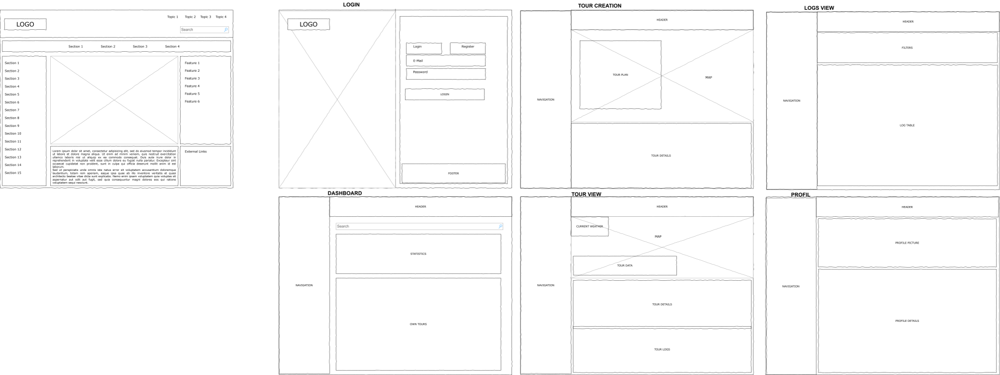

# Tour Planner – UX Protocol & Design Decisions

## 1. Introduction & Prototyping
For the initial conceptual visualization and rapid prototyping of the user interface, we utilized **Google Stitch**. This allowed us to evaluate the general layout, component structure, and user flow early on, before starting the actual implementation in Angular.

**[View Initial Google Stitch Prototype](https://stitch.withgoogle.com/u/1/projects/18200362333911212630?pli=1)**

Subsequently, the design was translated into highly reusable Angular Standalone Components using Tailwind CSS v4.

---

## 2. Core UI/UX Concepts
The design system and user experience are built upon the following core principles:

### 2.1. Responsive Design & "Bento" Lists
The entire layout is designed "Mobile-First" and scales seamlessly up to ultrawide monitors.
* **UX Rationale:** On mobile and medium-sized screens, the *Activity Log* view switches to a highly readable "stacked-card" view (Bento-style).

### 2.2. Real-Time Interaction (Reactive Forms)
Instead of forcing the user to type numerical values for ratings or difficulty levels via the keyboard, we implemented interactive sliders (`<input type="range">`).
* **UX Rationale:** The direct visual feedback—where the star display or difficulty badge updates in real-time while the user is dragging the slider—leads to a significantly more pleasant, modern, and fluid form entry experience.

### 2.3. Atomic Design System
The application deeply utilizes the Atomic Design pattern.
* **UX Rationale:** Elementary building blocks such as `<app-button>` or `<app-input>` guarantee a 100% consistent design language (spacing, hover states, focus rings) across all views and drastically reduce code duplication.

---

## 3. Wireframes

The detailed structural wireframes were created using **Draw.io** (`.drawio`) to capture the layout of the main views.

