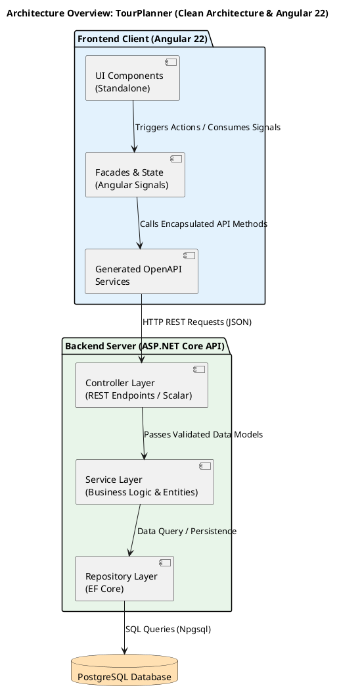
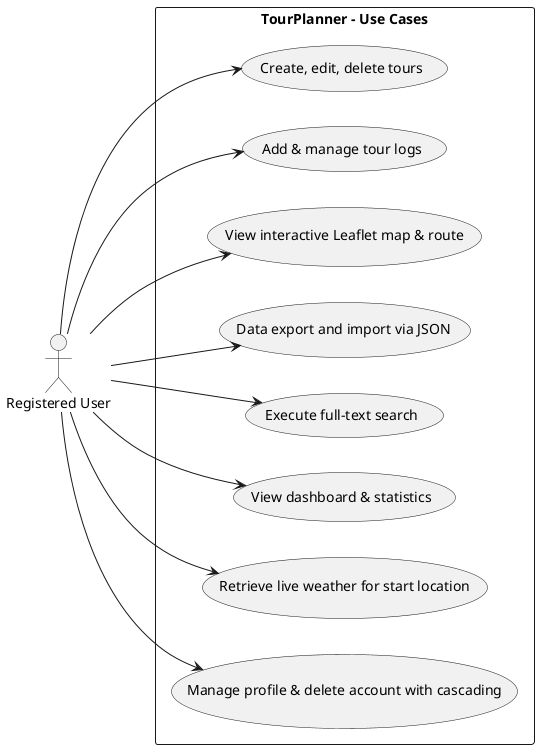
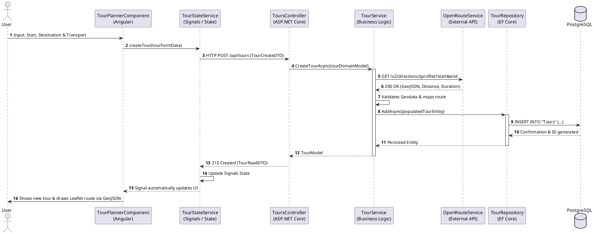

# Project Documentation – "TourPlanner"

## Link to GitHub
https://github.com/BIOApfelsaft/SWEN2_Tour_Planner
## Link to Trello Board
https://trello.com/b/5LRQHZb0/swen2tourplanner

---

## 1. Introduction and Project Overview

The **TourPlanner** project is a modern, web-based Single-Page Application (SPA) specifically developed for planning, logging, and analyzing individual tours and hikes. The application's goal is to provide users with an intuitive platform to create routes, record real travel experiences (logs), and view personalized, gamified statistics.

The development was carried out by an agile 2-person team, establishing a strict separation of functions between backend architecture (Marcel Scheder) and frontend engineering (Paul Trappl). With a total effort of approximately 180 working hours, a system was created that stands out through a clear layered architecture, reactive state management, and the integration of external geographic and weather services.

---

## 2. System Architecture (Layers & Functionality)

The system follows a strict separation of concerns using a modern client-server architecture. The backend provides a highly performant RESTful API, while the frontend acts as a reactive SPA.

### 2.1 Backend: C# ASP.NET Core Web API

The backend was built on .NET 10 / ASP.NET Core and implements a **3-layer architecture** (Clean Architecture) to maximize testability and maintainability:

1. **Controller Layer (API/Presentation):** Acts as the entry point for all HTTP requests, handling request routing, HTTP status code management, and input validation via Data Annotations. It uses dedicated **Data Transfer Objects (DTOs)** for data exchange with the frontend to prevent internal database entities from being directly exposed, and it automatically generates a standardized OpenAPI/Scalar specification serving as a contract for the frontend.

2. **Service Layer (Business Logic):** Contains the core logic of the application, such as statistics aggregation, validation algorithms, and score calculations. This layer is completely decoupled from HTTP contexts or database frameworks and operates exclusively with **Domain Models (Entities)**.

3. **Repository Layer (Data Access):** Encapsulates all database access using **Entity Framework Core (EF Core)**. Queries are abstracted via the Repository Pattern, keeping the underlying PostgreSQL database flexibly interchangeable.

### 2.2 Frontend: Angular 22 (SPA)

The frontend utilizes the latest paradigms of the Angular ecosystem for fast and memory-efficient execution:

* **Standalone Components:** Forgoes classic `NgModules`, allowing each component to declare its dependencies independently, which leads to smaller bundle sizes and faster load times.

* **State Management via Angular Signals:** Reactive UI synchronization is entirely based on Signals (`signal`, `computed`, `effect`), enabling a fine-grained change-detection system without the performance drawbacks of a global Zone.js check.

* **Services and Facades:** Business logic is offloaded into facades to keep UI components "dumb" and presentational. Communication with the REST API occurs via services automatically generated from the backend's Scalar specification using the `ng-openapi-gen` generator.

---

## 3. Use Cases

The system covers all essential functional requirements necessary for comprehensive tour management.

### 3.1 Detailed Feature Description

* **Tour Management:** Users can create, modify, or remove tours. When specifying start, destination, and transport type (e.g., foot, bike, car), the external service **OpenRouteService** is requested in the background to calculate the exact geographical route, distance, and estimated duration.

* **Tour Logs:** An unlimited number of experience reports can be saved for each tour, capturing the date, actual duration, distance covered, subjective difficulty, and a rating (1-5 stars).

* **Map & Routing:** An interactive Leaflet map visualizes the calculated route, interpreting the backend-delivered coordinates as a standardized GeoJSON object and drawing them directly on the map.

* **Data Management:** Enables cross-system import and export of the entire dataset (tours including all linked logs) in the form of a structured JSON file.

* **Global Search:** A high-performance real-time full-text search scans all tours and logs. On the frontend, server load is minimized using an RxJS `debounceTime` operator (300ms delay), while the backend executes highly efficient SQL `ILIKE` queries.

* **Statistics:** A dashboard presents raw log data graphically and in tabular form for the user.

* **User Management:** Provides secure registration and authentication (JWT-based) including protected session management in the frontend.

### 3.2 Sequence Diagram: Tour Creation and Route Calculation

The following diagram visualizes the synchronized flow between client, server, and external APIs when creating a new tour:

---

## 4. Technology Decisions & Lessons Learned

### 4.1 Technology Stack and Rationale

| Component | Chosen Technology | Rationale |
| --- | --- | --- |
| **Backend ORM** | Entity Framework Core | Powerful code-first ORM. |
| **Database Driver** | Npgsql | The official, highly optimized open-source driver for PostgreSQL connections under .NET.|
| **API Specification** | Scalar / OpenAPI | Automatic documentation of endpoints; serves as the single source of truth for client generation.|
| **Frontend Framework** | Angular 22 | Future-proof, highly structured, and offers out-of-the-box performant Standalone Components and native Signals.|
| **Styling** | Tailwind CSS | Utility-first approach allows extremely fast prototyping and consistent design without bloated CSS files.|
| **Maps** | Leaflet | Lightweight, open-source alternative to Google Maps that is excellent for SPAs and GeoJSON overlays.|
| **Reactive Streams** | RxJS | Indispensable for event processing, especially for asynchronous search optimization using streams.|

### 4.2 Lessons Learned and Technical Insights

1. **Strict Separation of DTOs and Domain Models:** Initially, mapping between DTOs and domain entities seemed like redundant extra work, but this architecture prevented severe runtime errors. Without DTOs, cyclic object relationships in EF Core caused infinite loops during JSON serialization, which the separation sustainably resolved.

2. **Refactoring UI Mockups to Tailwind CSS:** Translating the initial, auto-generated HTML/CSS mockups via Google Stitch (AI) into Tailwind utility classes required significant effort. However, the project now benefits from a highly maintainable UI, minimal global CSS code, and absolute design consistency.

3. **API-First Design with `ng-openapi-gen`:** Correctly configuring the OpenAPI generator initially demanded precise type definitions in the C# backend. Once the pipeline was set up, expanding the application became trivial, as new backend endpoints are immediately available in a type-safe manner in the frontend after a short script call, making an API-first approach highly recommended from day one.

4. **Lifecycle Management of Leaflet in SPAs:** Rapid switching between components led to phantom map instances, memory leaks, and errors when re-initializing the DOM container. In an SPA, map instances must be explicitly released and destroyed via `map.remove()` in the Angular `ngOnDestroy` lifecycle hook to properly clear occupied RAM.

---

## 5. Implemented Design Patterns

The software follows proven design patterns to guarantee extensibility and loose coupling:

* **Repository Pattern (Backend):** The `DbContext` of EF Core is encapsulated behind specific repositories, ensuring the business logic never knows how SQL statements are executed and significantly facilitating unit testing via mocks.

* **Arrange-Act-Assert (AAA):** We used the AAA pattern for our C# unit tests to keep them clear and maintainable: set up inputs, run the logic, then verify the results.

* **Dependency Injection (DI):** DI is used consistently in both ASP.NET Core and Angular 22 (using the modern `inject()` function), ensuring components request dependencies rather than instantiating them directly.

* **Facade Pattern (Frontend):** Complex subsystems like API HTTP calls and Leaflet map logic are hidden from the UI components.

* **Observer Pattern:** **Angular Signals** act as modern observers; when a signal's value changes, all dependent DOM elements and `computed` signals automatically update.

* **MVVM (Model-View-ViewModel):** In the frontend, this pattern separates the View (HTML template) from the Model (Domain Data). The Angular component, combined with the Facade, takes on the role of the ViewModel, preparing state for the View and handling user actions.

---

## 6. Quality Assurance & Unit Testing

We focused unit tests on the most critical business logic, covering the key decision paths and validation rules. The suite includes both happy paths and important edge cases, ensuring expected behavior. By asserting outcomes explicitly, the tests document the intended behavior and make future refactoring safer.

---

## 7. Unique Features

### 7.1 Gamified Stats-Service

To increase user retention, this backend service processes raw, historical log data and aggregates it into motivating "Fun Facts" for the dashboard:

* **Explorer Score:** Calculates a dynamic score based on the number of unique start and destination locations the user has already visited.

* **Toughest Challenge:** Filters out the specific tour that exhibits the highest combination of maximum distance and the highest difficulty level across logs.

* **Favorite Transport & Average Pace:** Determines the statistically most frequently used means of transport and the average speed (distance / duration) across all logs.

### 7.2 Live Weather Integration

To support safe and precise tour planning, a real-time weather API was integrated:

* As soon as a user opens the detailed view of a specific tour, the system extracts the geographic coordinates of the starting point.

* At that exact moment, a live, up-to-the-second request is sent to the weather service.

* The frontend visualizes the current temperature and weather condition (e.g., rain risk, cloud cover) directly on the tour map, allowing the user to immediately see if the tour can be undertaken.

### 7.3 Extended User Profile Management (Self-Service)

A user self-service portal was integrated:

* Users have administrative control over their identity and can autonomously change passwords, email addresses, and display names.

* **Cascading Deletion:** A protected "delete account" mechanism leads to cascading deletion in the repository layer. If a profile is deleted, the PostgreSQL database automatically removes all linked tours and their corresponding logs completely via foreign key constraints (`ON DELETE CASCADE`) to prevent orphaned data.

---

## 8. Tracked Time

The total effort for the conception, implementation, and documentation of the project amounted to **180 working hours**, split approximatly 50% backend and 50% frontend:

| Team Member | Focus Area | Task Fields | Effort |
| --- | --- | --- | --- |
| **Marcel Scheder** | Backend Development | Layered architecture, PostgreSQL data modeling, EF Core repositories, OpenRouteService integration, Scalar setup, JWT authentication, ... | **~90 hours**  |
| **Paul Trappl** | Frontend Development | UI/UX design implementation, Tailwind CSS refactoring, Angular 22 Signals state management, Leaflet map integration, RxJS search streams, JSON import/export pipeline, ... | **~90 hours**  |
| **Total** | **Full-Stack System** | **End-to-End integration, deployment preparation & documentation**  | **~180 hours**  |